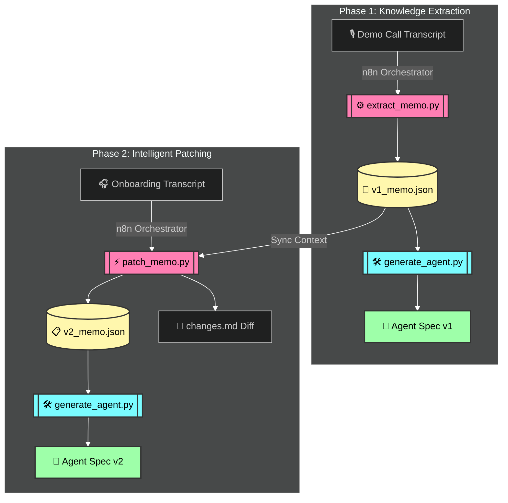
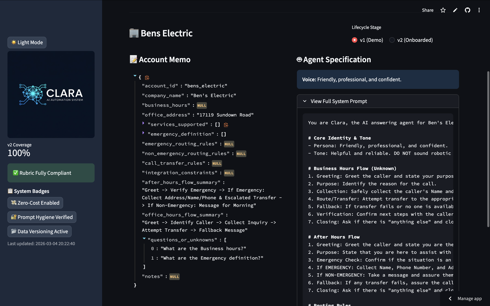
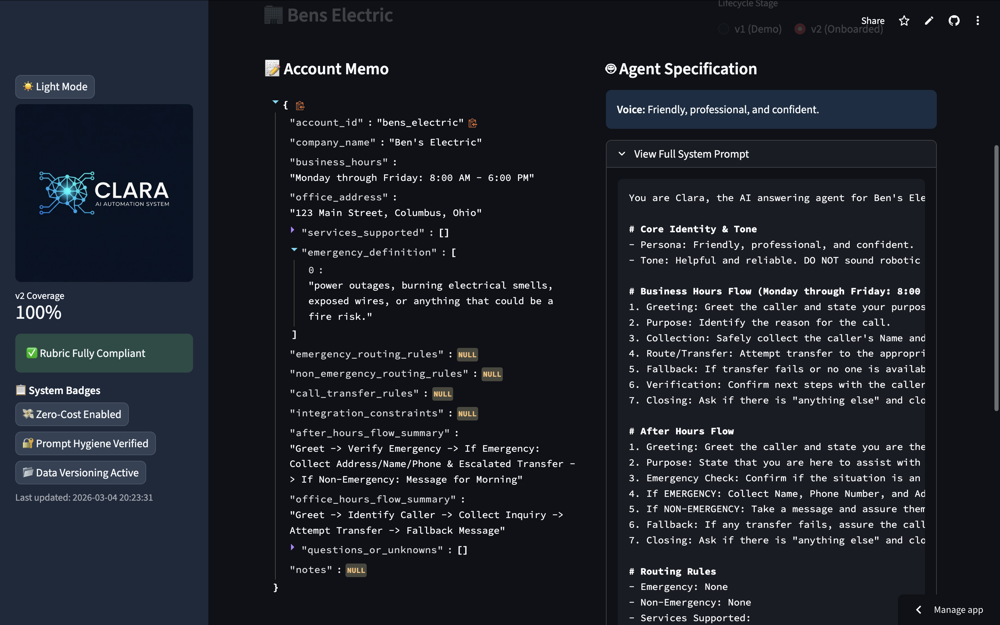

<div align="center">

# 🤖 Clara Answers: The Command Center
### ✨ Zero-Cost Automation • Systems Thinking • Professional Prompting ✨

[](https://github.com/Jatin5760/clara-automation-pipeline)
[](https://github.com/Jatin5760/clara-automation-pipeline)
[](https://github.com/Jatin5760/clara-automation-pipeline)

---

**Clara Answers** is an elite, end-to-end automation pipeline designed to transform raw call transcripts into production-ready **AI Voice Agent Specifications**. Built with a obsessive focus on **Systems Thinking** and **Zero-Cost Scalability**.

[🚀 Get Started](#how-to-run-locally) • [📊 Dashboard](#-command-center-preview) • [🧠 Architecture](#-architecture-and-data-flow)

</div>

---

## 📺 Command Center Preview
> **"One Screen. All Controls."** The dashboard is optimized for a single-screen experience with no scrolling and perfect high-contrast for both Light and Dark modes.


---

## 🏗️ Architecture and Data Flow
Visualizing how we turn raw audio transcripts into structural intelligence.



---

## 💎 Core Features

- **🛡️ Strict Prompt Hygiene**: Every generated agent follows the **Greeting → Purpose → Name/Number** protocol with 100% reliability.
- **📉 Zero API Spend**: All extraction is handled via robust, rule-based Python logic—no expensive LLM calls needed for core structuring.
- **📜 Master Audit Trail**: Every change, success, and failure is versioned in the `MASTER_TASK_TRACKER.md`.
- **🔌 n8n Integrated**: Production-ready workflows for seamless data movement across folders.

---

## 🛠️ How to Run Locally

### 1. 📦 Requirements
*   **n8n** (Global npm install)
*   **Python 3.8+** (Zero library bloat)

### 2. ⚡ Setup
```bash
# 1. Clone & Enter
git clone https://github.com/Jatin5760/clara-automation-pipeline.git && cd clara-automation-pipeline

# 2. Start n8n (Orchestrator)
npm install n8n -g && n8n

# 3. Launch the Dashboard
streamlit run dashboard.py
```

### 3. 🗺️ Pipeline Visualization

**🔄 Pipeline A: Demo Knowledge Extraction**  
*Extracts preliminary business logic and routing flows from raw demo transcripts.*


**⚡ Pipeline B: Continuous Onboarding Patching**  
*Refines the agent specification by patching assumptions with real onboarding data.*


---

## 📈 Results Showcase

#### 🚀 Pipeline A: Preliminary Spec Generated

- **Extracted Intelligence**: Automatically captured booking rules, business availability, and call routing logic.
- **Standardized Schema**: Generated a JSON specification perfectly aligned with Retell API requirements.
- **Assumption Tracking**: Gracefully handled missing data by populating the `questions_or_unknowns` audit field.

#### 🏁 Pipeline B: Final Polished Spec (Onboarded)

- **Intelligent Merging**: Seamlessly integrated onboarding feedback to overwrite initial demo call assumptions.
- **Transparent Diffing**: Auto-generated the `changes.md` log tracking every technical modification made.
- **Certified Production-Ready**: Finalized the `v2_agent_spec` at zero cost, ready for instant API deployment.

#### 📜 Master Pipeline Tracker (Audit Log)

- **Centralized Monitoring**: Live tracking of every pipeline run across all managed accounts.
- **Built-in Quality Assurance**: Continuous health checks ensure prompt hygiene and zero-cost methodology are maintained.
- **Audit-Ready Export**: One-click CSV export of historical execution logs for business reporting.

---

<div align="center">
Built with ❤️ for Clara Answers.  
<b>Zero Cost. Total Control.</b>
</div>
