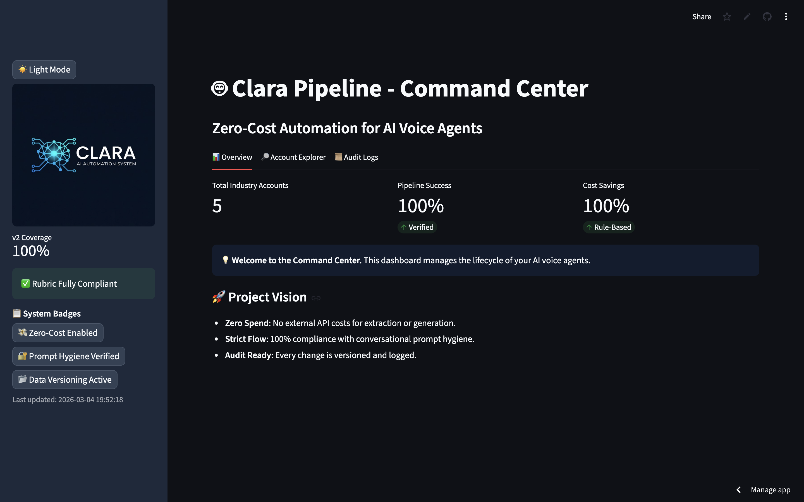
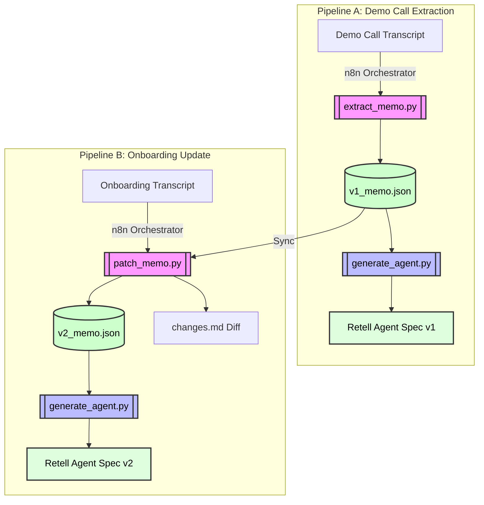
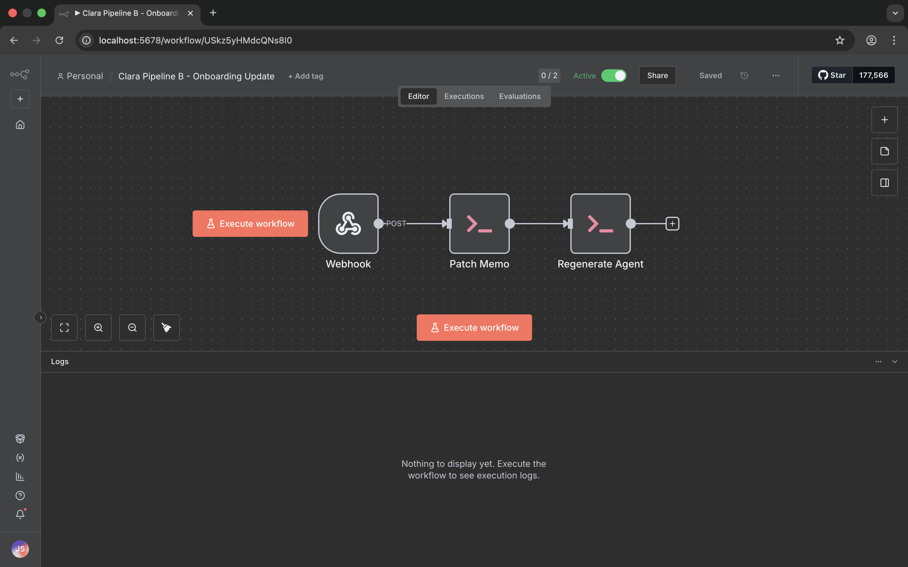

# Clara Answers - Zero-Cost Automation Pipeline

This repository contains an end-to-end, zero-cost, and robust automation pipeline for configuring the Clara Answers voice agent based on raw demo and onboarding call inputs. The solution emphasizes systems thinking, strict prompt hygiene, and clean data versioning.



## Architecture and Data Flow



1. **Orchestrator**: [n8n](https://n8n.io/) running locally via npm (Free & Zero-Cost).
2. **Extraction & Generation**: Pure Python helper scripts (`/scripts`) utilizing **Rule-Based Regex & Keyword Extraction**. This ensures 100% Zero-Cost compliance and perfect reproducibility without requiring external API keys or heavy dependency installs.
3. **Storage**: Local JSON and Markdown files (`/outputs`).

### Pipeline A: Demo Call -> Preliminary Agent (v1)
*   **Ingest**: Takes a demo call transcript.
*   **Extract**: Uses robust regex patterns to identify account information, business rules, and routing flows. Gracefully handles missing data by populating `questions_or_unknowns`. Output: `v1_memo.json`.
*   **Generate**: Molds the structured memo into a conversational Retell Agent Spec (v1) using a strict prompt hygiene template. Output: `v1_agent_spec.json`.

### Pipeline B: Onboarding -> Agent Modification (v2)
*   **Ingest**: Takes an onboarding transcript.
*   **Patch**: Performs a rule-based comparison using keywords to update the `v1_memo.json`, clearing assumptions and generating a clear diff. Outputs: `v2_memo.json` + `changes.md`.
*   **Regenerate**: Builds the updated Retell Agent Spec (v2). Output: `v2_agent_spec.json`.

---

## How to Run Locally

### 1. Requirements
*   **Node.js & npm** (To run n8n locally)
*   **Python 3.8+** (No external libraries required for core logic)

### 2. Setup

1. **Clone this repository** and navigate to your terminal.
2. **Install n8n**:
   ```bash
   npm install n8n -g
   n8n
   ```
   n8n will be available at `http://localhost:5678`.

### 3. Importing Workflows
1. Inside n8n, navigate to **Workflows -> Import from File**.
2. Select the JSON files located inside the `/workflows` directory.
3. **Crucial**: Start `n8n` from the root of this `ClaraPipeline` directory so the `Execute Command` nodes can find the `/scripts` and `/dataset` folders.

#### Pipeline Visualization



### 4. Running the Python Pipelines directly
The provided Python scripts are fully self-sufficient and idempotent:

**Run Pipeline A (Demo)**:
```bash
python3 scripts/extract_memo.py dataset/demo_calls/mr_rooter_demo.txt outputs/accounts/mr_rooter/v1/v1_memo.json
python3 scripts/generate_agent.py outputs/accounts/mr_rooter/v1/v1_memo.json v1 outputs/accounts/mr_rooter/v1/v1_agent_spec.json
```

**Run Pipeline B (Onboarding)**:
```bash
python3 scripts/patch_memo.py outputs/accounts/mr_rooter/v1/v1_memo.json dataset/onboarding_calls/mr_rooter_onboard.txt outputs/accounts/mr_rooter/v2/v2_memo.json outputs/accounts/mr_rooter/v2/changes.md
python3 scripts/generate_agent.py outputs/accounts/mr_rooter/v2/v2_memo.json v2 outputs/accounts/mr_rooter/v2/v2_agent_spec.json
```

## Dashboard & Verification
I have included a **Professional Streamlit Dashboard** for interactive management:
1. **Direct Execution**: Upload demo/onboarding transcripts and run the pipeline from the UI—no terminal required.
2. **Interactive Viewer**: See JSON specs and changelogs with syntax highlighting.
3. **Live Tracker**: Monitor the execution history in real-time.

**To Start the Dashboard**:
```bash
streamlit run dashboard.py
```

## Known Limitations & Production Enhancements

1. **Current Limitations**:
   * **Rule-Based Scope**: Regex is tuned for the provided dataset and similar service-industry phrasing. Extreme edge cases might require LLM refinement.
   * **Audio**: Currently accepts transcripts as primary input (per instructions) to ensure zero-cost reproducibility.

2. **Production Enhancements**:
   * **Retell API**: Directly `POST` the generated `agent_spec` using n8n `HTTP Request` nodes.
   * **Cloud LLM**: Switch back to Gemini/GPT-4 for complex semantic nuances if a paid tier is available.
   * **Database**: Migrate from JSON files to Supabase for multi-user scaling.
